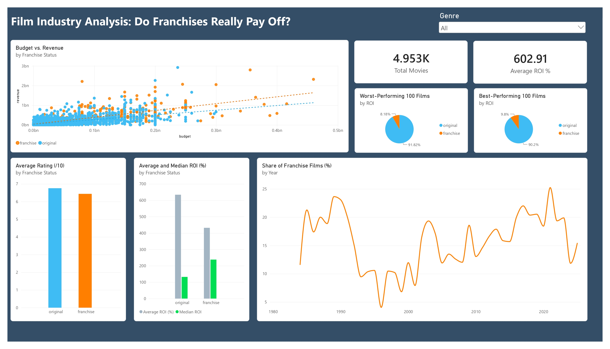

# Film Industry Analysis: Do Franchises Really Pay Off?

## Overview
This project started with a few recent releases catching my attention. 
Toy Story 5 came out this year to a wave of "enough sequels, give us something original" online and it went on to dominate the box office anyway, 
closing in on $1 billion worldwide. Well yes, it's Toy Story. 
Around the same time, Obsession, a genuinely original film with no franchise ties, 
became one of the summer's standout successes. Disney's live-action Moana remake, a "safe" IP-backed bet if there ever was one, flopped, opening to $95 million worldwide against a $250 million budget. 
The contrast of a beloved franchise entry cruising past the complaints, an original film breaking through on its own merit and a safe remake failing anyway, made me want to actually check the claim behind all of it: is the film industry over-relying on sequels and franchises because they're a "safer bet" financially and does the data back that up?
 
These specific 2026 releases sit outside the dataset used here (more on that below), so this project doesn't test those particular films directly. The discourse around these films just sparked the question.  
The rest of this README covers what almost 5000 films' worth of budget, revenue, and rating data actually shows.
 

## Data
- **Source**: [TMDB Top 10,000 Movies (Updated till 2025)](https://www.kaggle.com/datasets/pankajmaulekhi/tmdb-top-10000-movies-updated-till-2025) (Kaggle), pulled from the TMDB API
- After filtering out films with missing or zero budget/revenue, the working dataset contains **4,953 films**
- Franchise status was classified into three categories using each film's TMDB collection data and release date:
  - **Standalone** – not part of any collection
  - **Starter** – the first entry in a collection (an original creative bet, even though it later spawned a series)
  - **Subsequent** – a later entry in an existing collection
- Throughout this analysis, "original" refers to standalone + starter films combined and "franchise" refers to subsequent films specifically, since a franchise's first film was still a genuine creative risk at the time it was made.
- ROI is calculated as (revenue − budget) / budget, expressed as a percentage. For example, an ROI of 200% means a film earned twice its budget back in profit.
  
## Tools
- **Python (pandas)** – data cleaning, franchise classification
- **PostgreSQL / SQL** – core analysis (window functions, joins, correlation, percentile functions)
- **Excel** – cross-checking key figures with pivot tables
- **Power BI** – interactive dashboard

## Key Questions
1. Has the share of films continuing existing franchises increased over time?
2. Does more spend reliably mean more return and does that relationship hold equally for franchise and original films?
3. Do continuing franchise films actually earn more and get received better than standalone or franchise-starting films?
4. What do the biggest outliers look like and do they skew original or franchise?
5. Which genres deliver the best ROI and does that differ between franchise and original films?

## Key Findings

**1. Franchise share fluctuates rather than steadily rising.** Restricted to 1984–2025 (years with at least 30 films for reliable percentages), the share of films that are franchise continuations swings between roughly 5% and 20% rather than climbing in a straight line, complicating the simple "franchises are more dominant than ever" narrative.

**2. Bigger budgets buy scale, not efficiency.** Budget correlates strongly with revenue (r = 0.70) but has almost no relationship with ROI (r = -0.05). Franchise films show an even stronger budget–revenue relationship (r = 0.75) than original films (r = 0.62). Franchise spend is a more predictable bet for raw revenue but neither group's spend reliably buys a better proportional return.

**3. Franchises are the safer bet, originals are the higher-risk, higher-reward one.** Franchise films have a higher median ROI (238%) than original films (132%). A typical franchise film outperforms a typical original film. But original films have a much higher mean ROI (634% vs. 432%), driven by a small number of massive outlier hits: successful original films reach financial and critical highs franchise films have rarely ever matched. The average rating between original and franchise films is very similar (6.75/10 vs. 6.44/10).

**4. Original films dominate both extremes.** Across the 100 best- and 100 worst-performing films by ROI, roughly 90% in each group are original or franchise-starting films. Franchise films rarely produce either a spectacular win or a catastrophic flop, they cluster in a safer middle.

**5. Genre matters independently of franchise status.** Horror and Mystery deliver strong ROI regardless of franchise status. Beyond that, the picture diverges: franchise films additionally do well in Thriller and Romance, while original films perform best in Animation and Music.

**Extra finding: starter films actually do the best out of all three groups.** All of the above groups standalone and starter films together as "original," matching how the SQL analysis was structured throughout. But out of interest, while cross-checking figures in Excel, I broke "original" down into its two individual parts using pivot tables and found starter films (the first entry in what becomes a franchise) show by far the highest ROI of the three groups, both by mean (1796.80%) and median (325.23%), higher than standalone films (332.16% / 99.76%) or franchise continuations (431.83% / 237.81%). So the real upside isn't franchise reliance itself, it's successfully launching one in the first place.

## Limitations
- **The franchise flag reflects TMDB's collection groupings**, not general franchise/IP recognition. A well-known franchise that TMDB hasn't formally linked into one collection (e.g. Superman across different eras, or the same IP reused across different collections like animated vs. live-action 101 Dalmatians) may be undercounted.
- **"Starter" films can themselves be adaptations of pre-existing IP** (comics, novels), so this measures reliance on existing *film* franchises specifically, not broader reliance on established intellectual property.
- **"First entry" is based on the earliest release date within this cleaned dataset**, not necessarily the true first film in a series, since earlier entries may have been excluded by the budget/revenue filter or may fall outside this dataset's coverage entirely.
- **Roughly half of the original ~10,000-film dataset was dropped** due to missing or zero budget/revenue, likely biasing the remaining sample toward bigger, more commercially notable films.
- **Budget figures often reflect studio-reported estimates rather than true production costs** and studios have an incentive to underreport, a lower stated budget makes a film look more profitable in media coverage. For example, Jurassic World: Dominion is listed here with a $185M budget, while UK financial filings later revealed actual production costs of $450–658M (World of Reel, 2026). This is a well-documented industry pattern, not a one-off (IMDb, no date; Stanford Graduate School of Business, no date). ROI figures in this analysis likely overstate real profitability as a result, particularly for major studio releases.
- **Revenue reflects theatrical box office specifically** and fails for streaming-first or TV-first releases (e.g. Society of the Snow, a Netflix original, shows a reported worldwide gross of $1280), making genuinely successful films in terms of watch count, rating, and general discourse, appear as catastrophic flops because of the ROI.
- **A small number of figures appear to be data entry or scraping errors** rather than genuine outliers.
- **ROI here is a simplified** not true net profit. It doesn't account for marketing/distribution costs or the cinema's share of box office revenue.
- A minimum threshold of 30 films per year (and per genre, for Q5) was applied to avoid unreliable percentages from small samples. This is a reasonable cutoff rather than a statistically derived figure.

## Repository Contents
- `movies_cleaned.csv` – cleaned dataset (movie-level)
- `movie_genres.csv` – cleaned dataset exploded to one row per movie-genre pair, used for genre-level analysis
- `movies.ipynb` – data cleaning and franchise classification in pandas
- `queries.sql` – full SQL analysis for all five questions
- `movie_dashboard.pbix` – Power BI dashboard
- `movies_cleaned.xlsx` – Excel cross-checks and supplementary charts

## How to Run
**SQL analysis**: Load `movies_cleaned.csv` and `movie_genres.csv` into a PostgreSQL database, then run the queries in `queries.sql`.
 
**Notebook**: Open `movies.ipynb` in Jupyter to see the full data cleaning and franchise classification process.
 
**Power BI dashboard**: Open `movie_dashboard.pbix` in Power BI Desktop.
- Power BI Desktop is Windows only (on Mac it can be run through a Windows virtual machine; I used Parallels Desktop) or via Power BI Service in the browser.
  
**Excel**: Open `movies_cleaned.xlsx` to view the pivot tables and supplementary charts.

## References
IMDb (no date) *Box Office FAQ*. Available at: https://help.imdb.com/article/imdb/discover-watch/box-office-faq/G4UCJ3GMFX6F23ZX 
 
Stanford Graduate School of Business (no date) *What Does a Hollywood Blockbuster Look Like?* Available at: https://www.gsb.stanford.edu/insights/neil-malhotra-what-does-hollywood-blockbuster-look 
 
World of Reel (2026) *Jurassic World Dominion Is Now The Most Expensive Film Ever Made At $658M*. Available at: https://www.worldofreel.com/blog/2026/6/18/jurassic-world-dominion-is-now-the-most-expensive-film-ever-made-at-658m 
